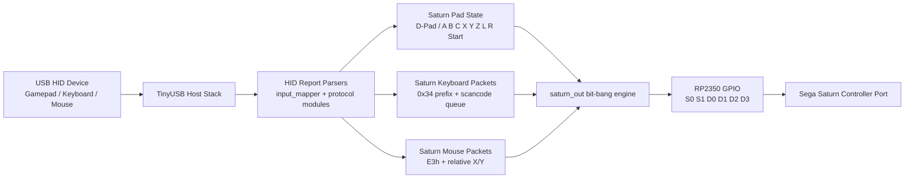

# USB2Saturn

A project to use USB input devices (Gamepads, Keyboards, Mice) on a Sega Saturn console using the Waveshare RP2350-USB-A development board.

## System Overview Diagram



## Hardware Requirements
- [Waveshare RP2350-USB-A](https://www.waveshare.com/wiki/RP2350-USB-A)
- Sega Saturn Controller Cable (or extension cord to cut)

## Schematics
See [docs/SCHEMATICS.md](docs/SCHEMATICS.md) for the wiring guide.
Power budgeting guidance: [Power Budget](docs/SCHEMATICS.md#power-budget).

Board design package:
- [docs/BOARD_DESIGN.md](docs/BOARD_DESIGN.md)
- [docs/BOARD_BOM.csv](docs/BOARD_BOM.csv)
- [docs/BOARD_NETLIST.csv](docs/BOARD_NETLIST.csv)

KiCad skeleton project:
- [hardware/USB2Saturn_Protection/USB2Saturn_Protection.kicad_pro](hardware/USB2Saturn_Protection/USB2Saturn_Protection.kicad_pro)
- [hardware/USB2Saturn_Protection/README.md](hardware/USB2Saturn_Protection/README.md)

Compilation and validation:
- [docs/BUILD_VALIDATION.md](docs/BUILD_VALIDATION.md)

Pinout data sources:
- Sega Saturn controller pinout: https://gamesx.com/controldata/saturn.htm
- Waveshare RP2350-USB-A pin reference: https://www.waveshare.com/wiki/RP2350-USB-A?srsltid=AfmBOord3EtosYRN9eA4ZmPHfdGHGz5l1G7hL_v2CVy890FmMrs2h8b_

## Building the Project
This project uses the Raspberry Pi Pico C/C++ SDK. 

### Prerequisites
- CMake
- ARM GCC Toolchain (`arm-none-eabi-gcc`)
- Pico SDK (included as a submodule)

### Build Instructions
```bash
git clone --recursive https://github.com/YOUR_USERNAME/USB2Saturn.git
cd USB2Saturn
mkdir build
cd build
cmake ..
make
```

### Flashing
1. Hold the `BOOT` button on the RP2350-USB-A board and plug it into your PC.
2. It will mount as a mass storage device.
3. Drag and drop the `USB2Saturn.uf2` file from the `build` directory onto the drive.
4. The board will automatically reboot and start running the software.

## Current Status
- Supports digital (hat/button) and analog-stick USB HID Gamepads mapped to the standard Sega Saturn controller layout.
- The Sega Saturn bit-bang protocol is implemented using GPIO interrupts.
- USB boot mouse reports are emitted as Sega Saturn mouse packets (`E3h`) with relative X/Y motion and button bits.
- USB boot keyboard reports keep Saturn control mapping (arrows/WASD + action key map).
- Added a Saturn keyboard peripheral mode with queued scancode output and lock-status bits.
- Added USB HID keycode to Saturn scancode translation for alphanumeric, function, arrows, and common punctuation keys.
- Host unit tests cover input mapping behavior in `tests/test_input_mapper.c`.
- Host protocol tests cover exact Saturn keyboard and mouse packet formatting.

Keyboard notes:
- Keyboard peripheral mode is selected automatically when a USB keyboard is active.
- Keyboard packet prefix is `%0011 %0100` (`0x34`) and packets are emitted as 12 nibbles per poll sequence.
- Make/Break bits and scancode nibbles follow the Saturn keyboard format documented by PlutieDev.
- This implementation is designed for Game BASIC style keyboard polling and may require per-title tuning as more Saturn keyboard traces are collected.

SMPC scope notes:
- Keyboard and mouse peripheral packets are implemented for SMPC control-mode polling (`INTBACK` path).
- SH-2 direct-mode peripheral handshake sequences are not currently emulated.

### USB Keyboard Mapping

| USB Key | Saturn Control |
| :--- | :--- |
| Up Arrow / W | D-Pad Up |
| Down Arrow / S | D-Pad Down |
| Left Arrow / A | D-Pad Left |
| Right Arrow / D | D-Pad Right |
| Z | A |
| X | B |
| C | C |
| A | X |
| S | Y |
| D | Z |
| Q | L |
| E | R |
| Enter / Space | Start |

## License
MIT License
