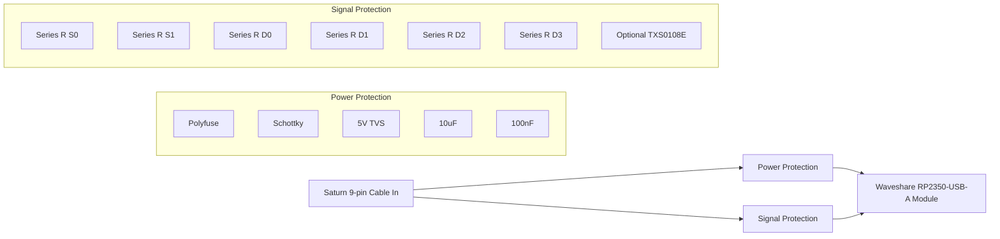

# USB2Saturn Protection Board Design

This document defines a practical 2-layer carrier/protection PCB for the USB2Saturn project.

## 1. Design Goals

- Protect Sega Saturn controller port from surge, ESD, and fault current.
- Prevent back-powering into the Saturn 5V rail.
- Preserve current firmware pin map:
  - S0 -> GP0
  - S1 -> GP1
  - D0 -> GP2
  - D1 -> GP3
  - D2 -> GP4
  - D3 -> GP5
- Support an optional level shifter stage (DNI by default).

## 2. Electrical Architecture

## 3. Schematic Connectivity

Power path:

- J1 pin 1 (SAT_VCC_IN) -> F1 -> VCC_FUSED -> D1 anode.
- D1 cathode -> VBUS_PROT -> U1 5V.
- TVS1 from VBUS_PROT to GND (cathode to VBUS_PROT, anode to GND).
- C1 (10uF) from VBUS_PROT to GND.
- C2 (100nF) from VBUS_PROT to GND.
- J1 pin 9 -> GND plane -> U1 GND.

Signal path (default direct, no level shifter populated):

- J1 pin 5 (S0) -> RS0 -> RP_S0 (U1 GP0).
- J1 pin 4 (S1) -> RS1 -> RP_S1 (U1 GP1).
- U1 GP2 (RP_D0) -> RD0 -> J1 pin 3 (D0).
- U1 GP3 (RP_D1) -> RD1 -> J1 pin 2 (D1).
- U1 GP4 (RP_D2) -> RD2 -> J1 pin 8 (D2).
- U1 GP5 (RP_D3) -> RD3 -> J1 pin 7 (D3).
- J1 pin 6 (DETECT) -> optional strap to SAT_VCC_IN (solder bridge SJ_DET).

Optional level-shifter mode (populate U2 + jumpers):

- Add two solder-jumper pairs per S0/S1 line:
  - Direct mode: SAT_Sx -> RSx -> RP_Sx.
  - Shifted mode: SAT_Sx -> U2 Bx, U2 Ax -> RP_Sx.
- Add two solder-jumper pairs per D0-D3 line:
  - Direct mode: RP_Dx -> RDx -> SAT_Dx.
  - Shifted mode: RP_Dx -> U2 Ax, U2 Bx -> RDx -> SAT_Dx.

## 4. Proposed Footprints

- U1 (RP2350-USB-A): Castellated module footprint matching Waveshare mechanical drawing.
- J1: 1x9 2.54 mm through-hole header or solder pads for cut controller cable.
- F1: 1206 resettable fuse.
- D1: SMA package Schottky diode.
- TVS1: SMB package TVS diode.
- C1: 1206 ceramic/electrolytic (10uF).
- C2: 0603 ceramic (100nF).
- RS0, RS1, RD0-RD3: 0603 resistors.
- U2 (optional): TXS0108E breakout header footprint, or QFN/TSSOP footprint if designing discrete.
- SJ_DET and signal selectors: 3-pad solder jumpers.

## 5. Board Outline And Placement

Recommended board outline: 55 mm x 20 mm, 2 layers, 1.6 mm FR4.

Placement order:

1. Place U1 at board center with USB-A connector edge overhanging board edge if desired.
2. Place J1 at cable-entry edge with strain relief holes nearby.
3. Place F1 and D1 directly between J1 pin 1 and U1 5V.
4. Place TVS1, C1, C2 within 5-8 mm of J1 power entry.
5. Place RS0/RS1 close to U1 GP0/GP1 pins.
6. Place RD0-RD3 close to J1 data output side.
7. Keep U2 and jumpers grouped near signal resistors if optional shifting is needed.

## 6. Routing Rules

- Two-layer stackup:
  - Top: signals and protected 5V route.
  - Bottom: mostly solid GND plane.
- Power trace widths:
  - SAT_VCC_IN and VBUS_PROT: >= 24 mil.
  - Signal traces: 8-10 mil is sufficient.
- Keep TVS return via to GND plane very short (target < 3 mm).
- Keep Schottky and polyfuse in straight series path from J1 pin 1.
- Maintain at least 10 mil clearance around Saturn-facing pins.

## 7. ERC/DRC And Bring-Up Checklist

- Verify diode orientation: D1 anode at fused Saturn 5V, cathode at board 5V.
- Verify TVS orientation: cathode to 5V, anode to GND.
- Verify no short between USB 5V source and Saturn 5V when both connected.
- Confirm all six series resistors are populated.
- In first power-up, test with current-limited bench supply before connecting to console.

## 8. Fabrication Defaults

- PCB: 2 layers, FR4, 1.6 mm, 1 oz copper.
- Finish: HASL lead-free or ENIG.
- Solder mask: any color.
- Silkscreen:
  - Mark Saturn pin numbers 1-9 clearly.
  - Mark diode polarity and TVS orientation.
  - Mark resistor designators by signal name (S0, S1, D0-D3).
