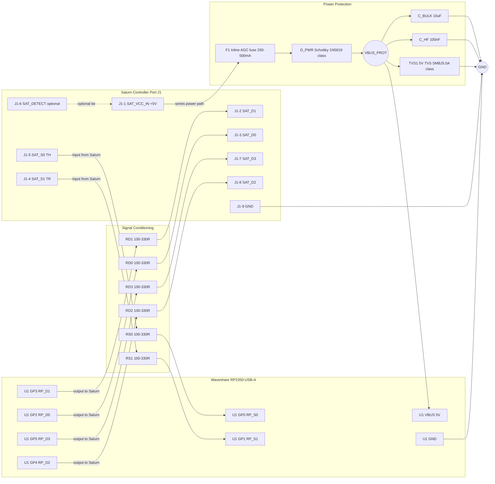

# USB2Saturn Schematics and Wiring

This document describes how to connect the Waveshare RP2350-USB-A development board to a Sega Saturn controller cable.

## Connector Physical Layout

The Sega Saturn uses a 9-pin connector arranged in a single row with beveled edges at the top. 

### 1. Console Port (Female)
If you are looking **directly at the front of the Sega Saturn console** into the port:
```text
      (Beveled Edge)
  _______________________
 /                       \
|  1  2  3  4  5  6  7  8  9  |
 -------------------------
```

### 2. Controller Cable Plug (Male)
If you cut a controller cable and look **directly into the male plug** (the pins facing you):
```text
      (Beveled Edge)
  _______________________
 /                       \
|  9  8  7  6  5  4  3  2  1  |
 -------------------------
```
*Note: If you look into the female port on the console, Pin 1 is on the left and Pin 9 is on the right.*

### 3. Waveshare RP2350-USB-A Board

The RP2350-USB-A board is shaped like a USB flash drive with castellated holes along its sides. The exact pin labels are printed on the silkscreen on the back of the board. A generic representation of the layout looks like this:

```text
         [ USB-A Plug ]
        ________________
       |                |
  5V --| 5V         GP0 |-- GP0  (S0 / TH)
 GND --| GND        GP1 |-- GP1  (S1 / TR)
 3V3 --| 3V3        GP2 |-- GP2  (D0)
GP29 --| GP29       GP3 |-- GP3  (D1)
GP28 --| GP28       GP4 |-- GP4  (D2)
GP27 --| GP27       GP5 |-- GP5  (D3)
GP26 --| GP26       GP6 |-- GP6
GP10 --| GP10       GP7 |-- GP7
 GP9 --| GP9        GP8 |-- GP8
       |________________|
```
*(Always verify the pin numbers using the printed text on the back of your specific board revision!)*

> [!WARNING]
> **Do not rely on wire colors!**
> There is no universal standard for Sega Saturn controller wire colors. Official controllers from different regions and third-party controllers all use completely different colored wires internally. 
> 
> You MUST use a multimeter in continuity mode to trace each physical pin on the connector to its corresponding wire inside the cable before soldering it to the RP2350. Guessing wire colors can result in sending 5V to the wrong pins and permanently damaging the RP2350 or your console.

## Hardware Protection Best Practices

When connecting a modern microcontroller to a retro console, it is highly recommended to add protective components to safeguard the console's internal hardware from surges, shorts, or back-powering.

### 1. Back-Powering Protection (Crucial)
The Sega Saturn outputs 5V (Pin 1) to power the controller. However, the RP2350-USB-A is designed to be powered via its USB port. **If you plug the RP2350 into a PC/Wall Adapter while it is also plugged into the Sega Saturn, the two 5V power supplies will clash.** This can destroy the Sega Saturn's power rail.
* **Solution**: Place a **Schottky diode** (e.g., `1N5817` or `1N5819`) in series on the 5V line coming from the Saturn. 
  * Connect the *Anode* (non-striped side) to the Saturn's Pin 1 (+5V).
  * Connect the *Cathode* (striped side) to the RP2350's `5V` pin.
  * This allows the Saturn to power the board, but blocks power from flowing *backward* into the Saturn if the USB is plugged in.

### 2. Current Limiting Resistors (Recommended)
If the RP2350 accidentally sets its pins to output 5V/3.3V while the Saturn is simultaneously driving the same line low, a short circuit occurs which can burn out the Saturn's I/O chip.
* **Solution**: Add small series resistors (typically **100Ω to 330Ω**) on every data line (`S0`, `S1`, `D0`-`D3`). This restricts the maximum current to a safe level (around 10mA) even if a short circuit occurs, protecting both devices.

### 3. Logic Level Shifters (Optional but Safest)
While the RP2350 GPIOs are 5V-tolerant *when powered*, they can be damaged if a 5V signal arrives while the board is unpowered. Furthermore, driving a 3.3V signal into a 5V system (the Saturn) usually works, but isn't strictly to 5V TTL spec.
* **Solution**: Use a bi-directional logic level shifter (like the `TXS0108E` module). Connect the 3.3V side to the RP2350 and the 5V side to the Sega Saturn. This perfectly translates the voltages and adds an extra layer of electrical buffering.

### 4. Power Surge / ESD Clamping (Strongly Recommended)
Hot-plugging cables, ESD events, or noisy power rails can inject short voltage spikes into the Saturn controller port.
* **Solution**: Add a **5V TVS diode** between `+5V` and `GND` on the adapter board, physically close to the Saturn cable entry.
    * Suggested part class: unidirectional 5V TVS (for example SMBJ5.0A-class).
    * TVS cathode to `+5V`, anode to `GND`.
    * This clamps fast spikes before they propagate into the Saturn or RP2350.

### 5. Overcurrent Limiting on Saturn 5V (Strongly Recommended)
If a wiring mistake or downstream fault occurs, the console's 5V rail can be overloaded.
* **Solution**: Add an **inline AGC/glass fuse** in series with Saturn Pin 1 (`+5V`) before the Schottky diode.
    * Typical starting point: `250mA` to `500mA` sacrificial fuse for a prototype build.
    * A small inline holder is easier to source locally than a low-current SMD resettable fuse.
    * This limits sustained fault current and helps protect the Saturn power rail.

## Bill of Materials (BOM)

The table below includes a practical parts list for the protection-focused wiring shown in this document.

| Qty | Reference | Part | Suggested Specification | Required |
| :-- | :-- | :-- | :-- | :-- |
| 1 | U1 | Waveshare RP2350-USB-A board | RP2350-USB-A | Yes |
| 1 | J1 | Sega Saturn controller cable/plug | 9-pin Saturn controller lead | Yes |
| 1 | D_PWR | Schottky diode | 1N5817 or 1N5819, series on +5V | Yes |
| 1 | F1 | Inline AGC/glass fuse + holder | 250mA to 500mA sacrificial fuse | Strongly Recommended |
| 1 | TVS1 | TVS diode, unidirectional | 5V TVS, SMBJ5.0A-class | Strongly Recommended |
| 1 | C_BULK | Bulk decoupling capacitor | 10uF, >=10V, low-ESR preferred | Recommended |
| 1 | C_HF | High-frequency bypass capacitor | 100nF ceramic, >=10V, X7R | Recommended |
| 2 | R_S0,R_S1 | Series resistors on S0/S1 | 100R to 330R, 1/8W or 1/4W | Recommended |
| 4 | R_D0-R_D3 | Series resistors on D0-D3 | 100R to 330R, 1/8W or 1/4W | Recommended |
| 1 | U2 | Bi-directional level shifter module | TXS0108E or equivalent | Optional |

> [!TIP]
> If you want a minimal but safer build, keep at least `D_PWR`, `F1`, `TVS1`, and all six series resistors.


## Pinout Mapping

Pinout data sources:
- Sega Saturn controller pinout: https://gamesx.com/controldata/saturn.htm
- Waveshare RP2350-USB-A pin reference: https://www.waveshare.com/wiki/RP2350-USB-A?srsltid=AfmBOord3EtosYRN9eA4ZmPHfdGHGz5l1G7hL_v2CVy890FmMrs2h8b_

| Sega Saturn Pin | Function | Direction | RP2350-USB-A Pin | Description |
| :--- | :--- | :--- | :--- | :--- |
| 1 | VCC (+5V) | Power Out | VBUS / 5V | Powers the RP2350 from the Saturn. |
| 2 | D1 | Data Out | GPIO 3 | Data bit 1 |
| 3 | D0 | Data Out | GPIO 2 | Data bit 0 |
| 4 | S1 (TR) | Data In | GPIO 1 | Select bit 1 |
| 5 | S0 (TH) | Data In | GPIO 0 | Select bit 0 |
| 6 | Detect (+5V)| Data Out | *Optional* | Often tied to VCC in standard controllers. |
| 7 | D3 | Data Out | GPIO 5 | Data bit 3 |
| 8 | D2 | Data Out | GPIO 4 | Data bit 2 |
| 9 | GND | Power | GND | Common Ground |

> [!IMPORTANT]
> The RP2350 GPIOs are 5V tolerant, meaning we can connect the S0 and S1 pins directly to the 5V signals from the Sega Saturn. The 3.3V logic outputs from D0-D3 will register as Logic HIGH on the 5V Sega Saturn side.
> 
> **However, you MUST ensure that the RP2350 board is powered (via the Saturn's VCC line or USB) BEFORE the Saturn console starts sending 5V logic signals to the GPIOs.** Applying 5V to the GPIO pins while the RP2350 is unpowered can damage the chip. Connecting VCC (Pin 1) to VBUS and Ground (Pin 9) to GND guarantees that the board is powered simultaneously with the signals.

## Wiring Diagram



> [!NOTE]
> The diagram above is a protection-focused wiring schematic. For the minimum wiring that still works, you can omit TVS/fuse/series resistors, but that increases risk to the Saturn in fault or ESD conditions.

## Power Budget

The Saturn controller port 5V rail can power the adapter and a low-power USB HID device, but available current margin is not guaranteed across all consoles and accessories. Treat the power path as budget-limited and validate with real measurements for your exact build.

### Current Budget Targets

Use this practical planning equation:

`I_total = I_RP2350 + I_USB_device + I_inrush_margin`

Recommended prototype targets:

- High-confidence target: `I_total <= 200mA`
- Typical acceptable ceiling: `I_total <= 250mA`
- Above `250mA`: use a powered USB hub or external regulated 5V source for the USB device side

### Typical Device Classes (Rule-of-Thumb)

| Device Type | Typical Current | Saturn-Powered Recommendation |
| :-- | :-- | :-- |
| Basic wired mouse (no lighting) | 20mA to 80mA | Usually OK |
| Basic wired keyboard (no backlight) | 30mA to 150mA | Usually OK |
| Gaming mouse with RGB | 80mA to 200mA | Check with USB meter first |
| Backlit / RGB keyboard | 150mA to 500mA+ | Not recommended without powered hub |
| Keyboard + mouse via passive splitter/hub | Sum of both + hub loss | Use powered hub |

### Fuse Selection Notes

- `250mA` inline fuse: stronger protection, but may nuisance-trip during startup surges on some keyboards.
- `500mA` inline fuse: better startup tolerance, but allows higher sustained fault current before opening.
- Start with `250mA` for conservative bench validation, then move to `500mA` only if repeated nuisance trips occur with known-good low-power devices.

### Bring-Up Checklist

1. Measure USB device current with a USB power meter before first Saturn power-up.
2. Confirm `I_total` stays within target during idle and keypress/mouse activity.
3. Check inrush behavior at plug-in (watch for brief spikes causing fuse trips).
4. If over budget or unstable, move USB device power to a powered hub.
